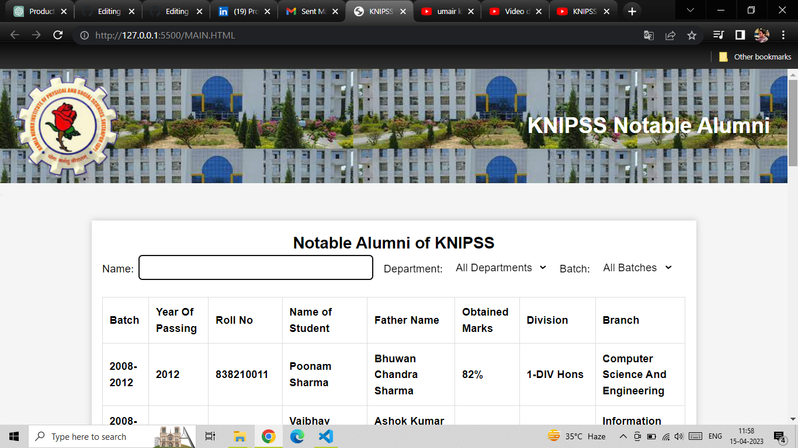
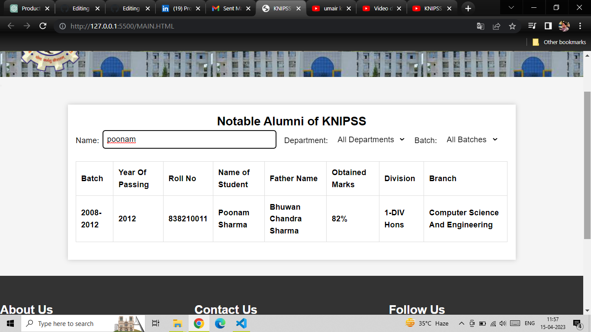
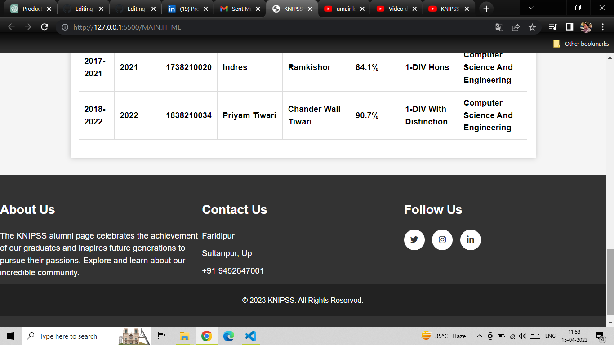

# KNIPSS Alumini  Web Page Project
an initiative that aims to create a platform for alumni of Kamla Nehru Institute of Physical And Social Science (KNIPSS) to connect, communicate, and collaborate with each other. As a volunteer effort, this project seeks to create a user-friendly and visually appealing website that can be accessed by alumni regardless of their technical expertise.

One of the key features of the KNIPSS Alumni Web Page is a list of honorable alumni who have passed out of the institution. This list serves as an inspiration for current students and a testament to the excellence of KNIPSS alumni. The website has been created using HTML, CSS, and Bootstrap to ensure that it is easy to navigate and visually appealing.

Our goal with this project is to strengthen the bond between KNIPSS alumni and provide them with a platform to network, collaborate, and support each other. We hope that the KNIPSS Alumni Web Page will serve as a hub for alumni to share their experiences, knowledge, and opportunities with each other. Thank you for your interest in this project, and we look forward to your continued support.

# Table of Contents
## Screenshot
## Video
## Installation
## Contributing

# Screenshot
there is the some screensot 

# Video

The video for the understanding

# Installation 
You can install this project directiory using this command
1. Clone the repository - git clone https://github.com/umairrrkhan/KNIPSS-Alumni--Web-Page-Project.git

# Contributing
Contributions to this project are always welcome! Here are a few ways you can help:
1. Report any bugs or issues you encounter while using the project.
2. Suggest new features or improvements.
3. Submit a pull request with bug fixes, improvements, or new features.
